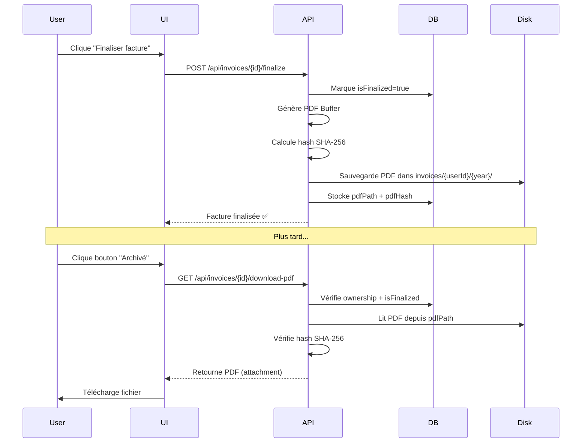

# 📦 SYSTÈME DE TÉLÉCHARGEMENT DES PDFs ARCHIVÉS

**Date**: 16 Novembre 2025
**Version**: 1.0
**Statut**: ✅ Implémenté et fonctionnel

---

## 📋 TABLE DES MATIÈRES

1. [Vue d'ensemble](#vue-densemble)
2. [Architecture](#architecture)
3. [Sécurité](#sécurité)
4. [API Routes](#api-routes)
5. [Interface utilisateur](#interface-utilisateur)
6. [Flux de données](#flux-de-données)
7. [Tests](#tests)
8. [Maintenance](#maintenance)

---

## 1. VUE D'ENSEMBLE

### Objectif

Permettre aux utilisateurs de télécharger les PDFs de leurs factures finalisées, qui sont archivés de manière sécurisée sur le serveur pour conformité légale (obligation d'archivage 10 ans en France).

### Fonctionnalités

- ✅ Téléchargement sécurisé des PDFs archivés
- ✅ Visualisation en ligne (inline) des PDFs
- ✅ Vérification d'intégrité (hash SHA-256)
- ✅ Authentification et autorisation
- ✅ Protection contre path traversal
- ✅ Cache côté client (1 an pour PDFs immuables)

### Différence avec le PDF généré à la volée

| Fonctionnalité | PDF Généré (`/api/invoices/[id]/pdf`) | PDF Archivé (`/api/invoices/[id]/download-pdf`) |
|----------------|----------------------------------------|--------------------------------------------------|
| **Factures** | Toutes (draft, sent, paid, etc.) | **Uniquement finalisées** |
| **Source** | Généré en temps réel depuis DB | **Fichier sur disque** |
| **Garantie** | Peut changer si data change | **Immuable, certifié** |
| **Hash** | Non | **Oui (vérification intégrité)** |
| **Performance** | Plus lent (génération) | **Rapide (lecture disque)** |
| **Usage** | Aperçu, brouillon | **Archive légale** |

---

## 2. ARCHITECTURE

### Structure de stockage

```
invoice-app/
└── invoices/                           # Dossier racine (HORS de public/)
    └── {userId}/                       # ID utilisateur (ex: 690936bc70aa94052d959793)
        └── {year}/                     # Année (ex: 2025)
            └── {invoiceNumber}.pdf     # Nom facture (ex: FAC2025-KAR-0009.pdf)
```

**Exemple** :
```
invoices/690936bc70aa94052d959793/2025/FAC2025-KAR-0009.pdf
```

### Champs dans le modèle Invoice

```typescript
interface IInvoice {
  // ... autres champs
  isFinalized: boolean;              // true = facture verrouillée
  finalizedAt?: Date;                // Date de finalisation
  finalizedBy?: mongoose.Types.ObjectId;  // Utilisateur ayant finalisé
  pdfPath?: string;                  // Chemin relatif (ex: "690936bc70aa94052d959793/2025/FAC2025-KAR-0009.pdf")
  pdfHash?: string;                  // SHA-256 hash pour vérification intégrité
}
```

### Fichiers créés/modifiés

#### Nouveaux fichiers

1. **`src/app/api/invoices/[id]/download-pdf/route.ts`**
   - Route API pour télécharger le PDF (attachment)
   - Vérification d'intégrité stricte

2. **`src/app/api/invoices/[id]/view-pdf/route.ts`**
   - Route API pour visualiser le PDF (inline)
   - Moins strict sur intégrité (log seulement)

#### Fichiers modifiés

3. **`src/components/invoices/InvoiceCard.tsx`**
   - Ajout bouton "Archivé" pour factures finalisées
   - Handler de téléchargement intégré

#### Fichiers existants (réutilisés)

4. **`src/lib/invoices/storage.ts`**
   - Fonctions de lecture/vérification déjà présentes
   - `readInvoicePdfFromServer()`
   - `invoicePdfExists()`
   - `verifyPdfIntegrity()`

---

## 3. SÉCURITÉ

### Mesures de sécurité implémentées

#### 1. Authentification

```typescript
const session = await auth();
if (!session?.user?.id) {
  return NextResponse.json({ error: 'Authentification requise' }, { status: 401 });
}
```

✅ Seuls les utilisateurs connectés peuvent accéder

#### 2. Autorisation (Ownership)

```typescript
const invoice = await Invoice.findOne({
  _id: id,
  userId: session.user.id,  // ✅ Vérifie que l'utilisateur est propriétaire
}).lean();
```

✅ Un utilisateur ne peut télécharger QUE ses propres factures

#### 3. Vérification finalisation

```typescript
if (!invoice.isFinalized) {
  return NextResponse.json({
    error: 'Facture non finalisée',
    message: 'Seules les factures finalisées ont un PDF archivé',
  }, { status: 400 });
}
```

✅ Seules les factures finalisées sont accessibles

#### 4. Protection Path Traversal

```typescript
// Dans storage.ts
export function isSecurePath(relativePath: string): boolean {
  const fullPath = path.join(INVOICES_STORAGE_ROOT, relativePath);
  const normalizedPath = path.normalize(fullPath);
  const normalizedRoot = path.normalize(INVOICES_STORAGE_ROOT);

  return normalizedPath.startsWith(normalizedRoot);
}
```

✅ Impossible d'accéder à des fichiers en dehors de `/invoices`

**Tentatives bloquées** :
- `../../etc/passwd` ❌
- `../../../users.db` ❌
- `C:\Windows\System32\config\SAM` ❌

#### 5. Vérification d'intégrité (Hash SHA-256)

```typescript
if (invoice.pdfHash) {
  const integrity = await verifyPdfIntegrity(invoice.pdfPath, invoice.pdfHash);

  if (!integrity.verified) {
    console.error(`⚠️ Intégrité PDF compromise: ${invoice.pdfPath}`);
    return NextResponse.json({
      error: 'PDF altéré',
      message: 'L\'intégrité du PDF ne peut pas être vérifiée',
    }, { status: 500 });
  }
}
```

✅ Détecte si le PDF a été modifié sur disque

**Hash stocké lors de la finalisation** :
```typescript
const pdfHash = calculatePdfHash(pdfBuffer);  // SHA-256
await Invoice.updateOne(
  { _id: invoiceId },
  { $set: { pdfHash } }
);
```

#### 6. Validation ID

```typescript
if (!mongoose.Types.ObjectId.isValid(id)) {
  return NextResponse.json({ error: 'ID de facture invalide' }, { status: 400 });
}
```

✅ Empêche injections et IDs malformés

---

## 4. API ROUTES

### Route 1: Download PDF (Attachment)

**Endpoint**: `GET /api/invoices/[id]/download-pdf`

**Usage**: Télécharger le PDF sur l'ordinateur de l'utilisateur

**Headers de réponse**:
```http
Content-Type: application/pdf
Content-Disposition: attachment; filename="FAC2025-KAR-0009.pdf"
Content-Length: 4332
Cache-Control: private, max-age=31536000
X-Invoice-Id: 673822b51a7c47dc5f8e3f9a
X-Invoice-Number: FAC2025-KAR-0009
X-PDF-Verified: true
```

**Codes de statut**:
- `200` - Succès, PDF retourné
- `400` - Facture non finalisée
- `401` - Non authentifié
- `403` - Accès interdit (path traversal détecté)
- `404` - Facture ou PDF introuvable
- `500` - Erreur serveur ou intégrité compromise

**Exemple d'utilisation**:
```typescript
const response = await fetch(`/api/invoices/${invoiceId}/download-pdf`);
const blob = await response.blob();
const url = window.URL.createObjectURL(blob);
const a = document.createElement('a');
a.href = url;
a.download = `${invoiceNumber}.pdf`;
a.click();
```

---

### Route 2: View PDF (Inline)

**Endpoint**: `GET /api/invoices/[id]/view-pdf`

**Usage**: Afficher le PDF dans le navigateur

**Différence avec download-pdf**:
```http
Content-Disposition: inline; filename="FAC2025-KAR-0009.pdf"
                     ^^^^^^
                     S'ouvre dans le navigateur au lieu de télécharger
```

**Exemple d'utilisation**:
```html
<iframe
  src={`/api/invoices/${invoiceId}/view-pdf`}
  width="100%"
  height="600px"
  title="Aperçu PDF"
/>
```

---

## 5. INTERFACE UTILISATEUR

### Bouton dans InvoiceCard

Le bouton "Archivé" apparaît **uniquement** pour les factures finalisées ayant un `pdfPath` :

```tsx
{invoice.isFinalized && invoice.pdfPath && (
  <Button
    variant="outline"
    className="bg-purple-900/30 border-purple-700 text-purple-300"
    onClick={async () => {
      const response = await fetch(`/api/invoices/${invoice._id}/download-pdf`);
      const blob = await response.blob();
      // ... téléchargement
    }}
  >
    <Archive className="w-4 h-4 mr-1.5" />
    Archivé
  </Button>
)}
```

### Apparence visuelle

```
┌─────────────────────────────────────────────────────────┐
│  Facture FAC2025-KAR-0009                        [🔒]   │
│  Client: Acme Corp                                      │
│  Total: 1 234,56 € • Payée                              │
│                                                          │
│  [✏️ Statut] [📧 Email] [📄 PDF] [📦 Archivé] [🗑️]      │
│              └─────────┘ └─────────┘                    │
│              Généré      Télécharger                     │
│              temps réel  PDF légal                       │
└─────────────────────────────────────────────────────────┘
```

**Couleurs** :
- **Bouton "PDF"** : Vert (génération à la volée)
- **Bouton "Archivé"** : Violet/Purple (PDF légal immuable)

**Tooltip au survol** :
```
📦 Télécharger PDF archivé (légal)
```

---

## 6. FLUX DE DONNÉES

### Flux complet de finalisation → téléchargement



### Chemins de lecture

**1. Génération PDF à la volée** (`/api/invoices/[id]/pdf`):
```
DB (Invoice data) → PDF Generator → Buffer → Response
```

**2. Téléchargement PDF archivé** (`/api/invoices/[id]/download-pdf`):
```
DB (pdfPath + pdfHash) → Disk → Buffer → Hash Verify → Response
```

---

## 7. TESTS

### Tests manuels

#### Test 1: Téléchargement facture finalisée

```bash
# 1. Créer une facture
# 2. Marquer comme payée
# 3. Finaliser
# 4. Cliquer bouton "Archivé"
# ✅ Vérifier: PDF se télécharge avec nom correct
```

#### Test 2: Facture non finalisée

```bash
# 1. Créer une facture (status = draft)
# 2. Vérifier que bouton "Archivé" n'apparaît PAS
# ✅ Attendu: Bouton absent
```

#### Test 3: Tentative accès PDF d'un autre utilisateur

```bash
# 1. User A finalise une facture (ID: abc123)
# 2. User B tente: GET /api/invoices/abc123/download-pdf
# ✅ Attendu: 404 Not Found
```

#### Test 4: PDF altéré

```bash
# 1. Finaliser une facture
# 2. Modifier manuellement le PDF sur disque
# 3. Tenter de télécharger
# ✅ Attendu: 500 "PDF altéré"
```

#### Test 5: Path traversal

```bash
curl -X GET \
  'http://localhost:3000/api/invoices/../../etc/passwd/download-pdf' \
  -H 'Cookie: session=...'

# ✅ Attendu: 403 Forbidden ou 400 Bad Request
```

### Tests automatisés (à implémenter)

```typescript
// tests/api/invoices/download-pdf.test.ts
describe('GET /api/invoices/[id]/download-pdf', () => {
  it('should download PDF for finalized invoice', async () => {
    // Test success case
  });

  it('should reject non-finalized invoice', async () => {
    // Test 400 error
  });

  it('should reject unauthorized user', async () => {
    // Test 401/404 error
  });

  it('should detect PDF tampering', async () => {
    // Test hash verification
  });
});
```

---

## 8. MAINTENANCE

### Vérifier l'espace disque

```bash
# Taille totale des PDFs archivés
du -sh invoices/

# Par utilisateur
du -sh invoices/*/

# PDFs les plus volumineux
find invoices/ -name "*.pdf" -exec du -h {} + | sort -rh | head -10
```

### Nettoyage (avec précaution)

⚠️ **ATTENTION** : Obligation légale d'archivage 10 ans en France !

```bash
# Lister PDFs de plus de 10 ans
find invoices/ -name "*.pdf" -mtime +3650

# NE PAS supprimer sans audit légal préalable
```

### Migration vers cloud storage (optionnel)

Si vous souhaitez migrer vers AWS S3, Google Cloud Storage, etc. :

1. **Modifier `storage.ts`** pour utiliser SDK cloud
2. **Garder `pdfPath`** dans DB mais changer format :
   - Avant : `690936bc70aa94052d959793/2025/FAC2025-KAR-0009.pdf`
   - Après : `s3://bucket-name/invoices/690936bc70aa94052d959793/2025/FAC2025-KAR-0009.pdf`
3. **Adapter routes API** pour lire depuis cloud

### Monitoring

**Métriques à surveiller** :
- Nombre de téléchargements par jour
- Temps de réponse de l'API
- Taux d'erreur (404, 500)
- Alertes sur échecs de vérification hash

**Logs à conserver** :
```typescript
console.log(`✅ PDF téléchargé: ${invoiceNumber} par user ${userId}`);
console.error(`⚠️ Hash mismatch: ${pdfPath}`);
```

---

## 9. RÉSUMÉ

### Ce qui a été implémenté

✅ **2 Routes API sécurisées**
- `/api/invoices/[id]/download-pdf` (attachment)
- `/api/invoices/[id]/view-pdf` (inline)

✅ **Bouton UI dans InvoiceCard**
- Apparaît uniquement si `isFinalized && pdfPath`
- Style violet/purple pour distinguer de PDF généré
- Téléchargement avec nom fichier correct

✅ **Sécurité complète**
- Authentification
- Autorisation (ownership)
- Vérification intégrité (hash SHA-256)
- Protection path traversal
- Validation des IDs

✅ **Performance**
- Cache 1 an (PDFs immuables)
- Lecture directe depuis disque (rapide)

### Ce qu'il reste à faire (optionnel)

⚠️ **Tests automatisés**
- Créer tests Jest/Vitest pour routes API
- Tester tous les cas d'erreur

⚠️ **Monitoring**
- Ajouter analytics sur téléchargements
- Alertes sur échecs hash

⚠️ **Documentation utilisateur**
- Ajouter page d'aide expliquant PDFs archivés
- FAQ sur conformité légale

---

## 10. SUPPORT & DÉPANNAGE

### Problème: "PDF introuvable"

**Cause**: `pdfPath` dans DB mais fichier absent sur disque

**Solution**:
```bash
# Régénérer le PDF
1. Récupérer données facture depuis DB
2. Générer PDF
3. Sauvegarder avec saveInvoicePdfToServer()
4. Mettre à jour pdfPath + pdfHash dans DB
```

### Problème: "Intégrité PDF compromise"

**Cause**: Fichier PDF modifié après finalisation

**Solution**:
```bash
# Option 1: Régénérer (si données DB intactes)
1. Générer nouveau PDF depuis DB
2. Recalculer hash
3. Remplacer fichier + hash dans DB

# Option 2: Restaurer depuis backup
1. Chercher dans backups quotidiens
2. Restaurer fichier PDF original
```

### Problème: "Accès interdit"

**Cause**: Path traversal détecté ou user non-owner

**Solution**:
```bash
# Vérifier ownership
db.invoices.findOne({ _id: ObjectId("...") })

# Si erreur légitime, contacter admin
```

---

**Fin de la documentation** 📄

Pour toute question, référez-vous aux fichiers source :
- `src/app/api/invoices/[id]/download-pdf/route.ts`
- `src/app/api/invoices/[id]/view-pdf/route.ts`
- `src/lib/invoices/storage.ts`
- `src/components/invoices/InvoiceCard.tsx`
